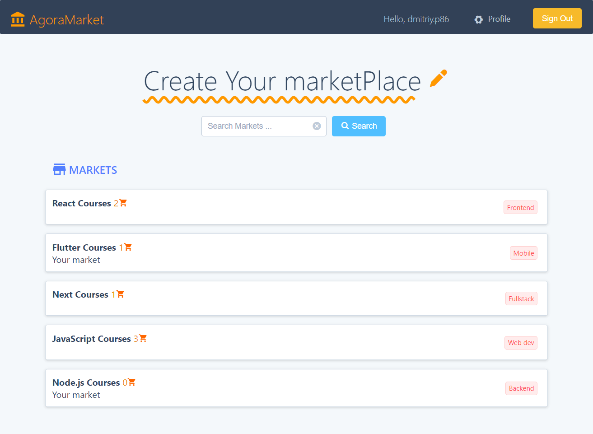
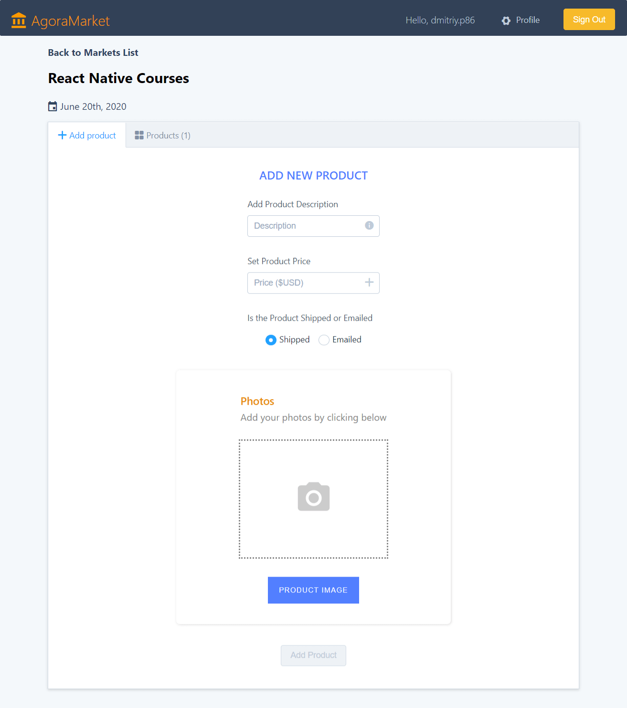
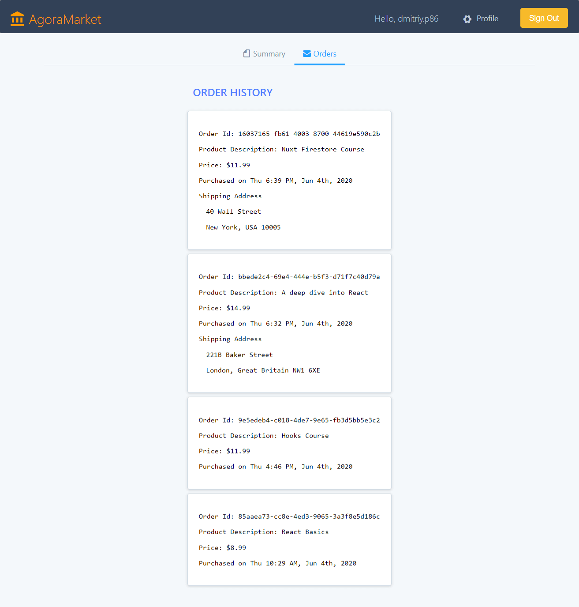

# AmplifyMarketplace

Marketplace-on-Amplify is a serverless React application using AWS Amplify and several other services. 

At the beginning we need to log in. To do this, we do not need to write logic and forms, we just use AWS Amplify authentication, which does all this for us and saves user data in the Amazon Cognito User Pool. On the main page we see a list of markets or/and the ability to add a new one. There is also a search box that uses Amazon Elasticsearch.

If you click on the name of the market, you will go to it. Here, the owner can add a new one, while other users will be able to only view and purchase products added by the owner. When adding, you need to specify a Description and Price, choose whether this product will be Shipped or Emailed and add a preview image.

If the Shipped method is selected, the user will be asked to enter their address during the purchase. This data can then be viewed in the Order history, which is located in the second tab of the user profile. If Emailed is selected, then the Shipping address will not be in the order.

To implement the server functions, we used the serverless ExpressJS functions in the AWS Lambda service. Here, not only the purchase of goods is implemented, but also the sending of an email with confirmation through the Amazon SES service.

Also worth noting is schema.graphql, which is used by AWS Amplify to create the GraphQL API. This allows us to describe data types and the scheme of their interaction, and queries will be generated and in most cases we can use them without change.

### Running locally

To run this application locally you need, after cloning the repository and installing the packages, also install CLI and configure the application. To install Amplify CLI [read the guide](https://docs.amplify.aws/cli/start/install).Then run the command:

`amplify init`

Here we simply indicate everything standard that we use (javascript, react, etc.). After which we add the API:

`amplify add api`

Here we choose GraphQL. This command allows you to select an authorization service. In our case used Cognito, provided by: awscloudformation. We choose that we will use to enter Email and Phone Number. And at the end, we indicate that we want a guided schema creation. After which Amplify will open a schema.graphql file. Its code can be found in the root of the repository. When saving it will create GraphQL for us locally and to upload it you need to execute the command:

`amplify push`

This command should be executed every time after adding any resource. We also need to add a storage for the picture:

`amplify add storage`

And at the end we add another API:

`amplify add api`

This time you need to select REST. You need to create a AWS Lambda function called orderlambda. Which will on the "/charge" path perform functionality using ExpressJS. The code for this application can be found in the app.js file in the root of the repository.